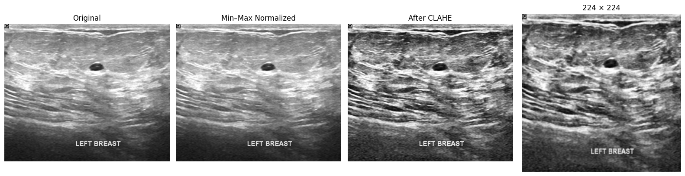
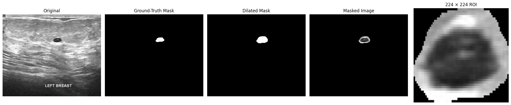
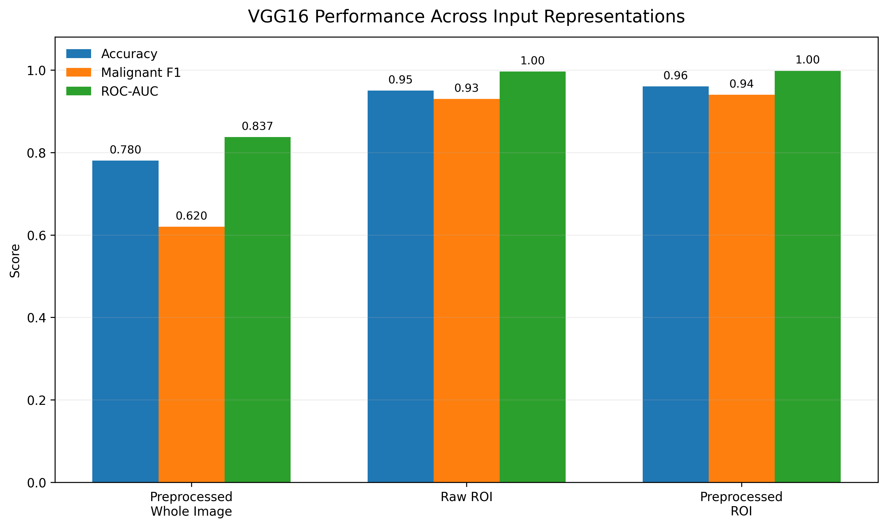
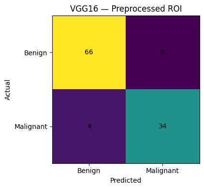

# AI-Based Medical Image Analysis for Breast Lesion Classification

> **Deep learning for benign vs malignant breast-lesion classification using breast ultrasound images, lesion-focused ROI extraction, and VGG16 transfer learning.**

[](https://www.python.org/)
[](https://www.tensorflow.org/)
[](https://scholar.cu.edu.eg/?q=afahmy/pages/dataset)
[](https://keras.io/api/applications/vgg/)

## Overview

This project investigates whether **lesion-focused image representation** improves breast-lesion classification from ultrasound images.

The study uses the **Breast Ultrasound Images (BUSI)** dataset and evaluates a VGG16 transfer-learning classifier under three input conditions:

1. **Preprocessed Whole Image** — min-max normalization + CLAHE.
2. **Raw ROI** — lesion-focused region extracted using the BUSI ground-truth mask.
3. **Preprocessed ROI** — lesion-focused ROI extracted from the normalized + CLAHE image.

The project was completed as a team project. I **led the team** and was primarily responsible for image preprocessing, lesion ROI extraction, VGG16 implementation, experimental analysis, and reporting.

---

## Research Question

> **Does lesion-focused ROI extraction, with or without contrast enhancement, improve benign/malignant breast-lesion classification performance?**

The experimental design compares different input representations while keeping the downstream VGG16 architecture and training protocol consistent.

```text
                         BUSI Ultrasound Images
                                  │
                       Patient-level data split
                                  │
              ┌───────────────────┼───────────────────┐
              │                   │                   │
       Whole Image             Raw ROI        Preprocessed ROI
              │                   │                   │
       Normalization             │          Normalization + CLAHE
          + CLAHE                │                   │
              │                   │                   │
              └───────────────────┼───────────────────┘
                                  ↓
                         VGG16 Transfer Learning
                                  ↓
                        Global Average Pooling
                                  ↓
                            Dense (256)
                                  ↓
                           Dropout (0.5)
                                  ↓
                         Sigmoid Classification
                                  ↓
                       Accuracy / F1 / ROC-AUC
```

---

## Dataset

The project uses the **Breast Ultrasound Images (BUSI)** dataset for binary classification of breast lesions into:

- **Benign**
- **Malignant**

The dataset also provides lesion ground-truth masks used for the ROI extraction experiments.

The BUSI dataset is **not included in this repository**. Obtain it from the original source and place it locally under:

```text
data/
└── Dataset_BUSI_with_GT/
    ├── benign/
    ├── malignant/
    └── normal/
```

The `normal` class is retained in the source dataset but is not used in the lesion-ROI extraction/classification experiments documented here.

---

## Methodology

### 1. Image preprocessing

The original BUSI images had already undergone some preprocessing. Additional denoising was considered during development, but Gaussian denoising did **not improve downstream classification performance** and was therefore excluded from the final pipeline.

The final preprocessing pipeline was:

**Grayscale ultrasound image → Min-Max normalization → CLAHE → Resize to 224 × 224**

CLAHE configuration:

```text
clipLimit = 2.0
tileGridSize = (8, 8)
```

#### Preprocessing example



*Image preprocessing pipeline: min-max normalization, CLAHE-based contrast enhancement, and resizing to 224 × 224.*

See [`01_image_preprocessing.ipynb`](notebooks/01_image_preprocessing.ipynb).

---

### 2. Lesion ROI extraction

Lesion-focused ROIs were extracted using the BUSI ground-truth lesion masks.

The procedure was:

```text
Ground-truth mask
        ↓
15 × 15 elliptical morphological dilation
        ↓
Apply mask to ultrasound image
        ↓
Crop to lesion-containing bounding box
        ↓
Resize to 224 × 224
```

Two ROI variants were generated:

- **Raw ROI** — extracted from the original image.
- **Preprocessed ROI** — extracted from the normalized + CLAHE image.

#### ROI extraction example



*Mask-guided lesion ROI extraction using the BUSI ground-truth mask, morphological dilation, masking, bounding-box cropping, and resizing.*

> **Important:** ROI extraction is **mask-guided**, not an automatic lesion-detection or segmentation system. Ground-truth masks are used because this is an experimental classification study.

See [`02_roi_extraction.ipynb`](notebooks/02_roi_extraction.ipynb).

---

### 3. Patient-level splitting

To reduce data leakage, the original experiment split data at the **patient level** rather than randomly splitting individual images.

The original experiment used:

- `random_state = 42`
- Approximately 70% training patients
- 15% validation patients
- 15% test patients
- **Train/test patient overlap: 0**

Recorded image counts:

| Split | Images |
|---|---:|
| Training | 436 |
| Validation | 107 |
| Test | 104 |

---

### 4. VGG16 transfer learning

The classifier uses **VGG16 pretrained on ImageNet**, with the original classification head removed.

The convolutional backbone was frozen and a task-specific classification head was added:

```text
VGG16 (ImageNet, frozen)
        ↓
GlobalAveragePooling2D
        ↓
Dense(256, ReLU)
        ↓
Dropout(0.5)
        ↓
Dense(1, Sigmoid)
```

| Parameter | Value |
|---|---:|
| Input size | 224 × 224 |
| Batch size | 16 |
| Epochs | 20 |
| Backbone | VGG16 |
| Pretrained weights | ImageNet |
| Backbone trainable | No |
| Dense layer | 256 |
| Dropout | 0.5 |
| Optimizer | Adam |
| Learning rate | 0.0001 |
| Loss | Binary cross-entropy |
| Classification threshold | 0.5 |

See [`03_vgg16_model_comparison.ipynb`](notebooks/03_vgg16_model_comparison.ipynb).

---

## Results

The three experimental conditions produced the following **recorded test-set results**:

| Input condition | Accuracy | Malignant F1 | ROC-AUC |
|---|---:|---:|---:|
| Preprocessed Whole Image | 0.78 | 0.62 | 0.837 |
| Raw ROI | 0.95 | 0.93 | 0.996 |
| **Preprocessed ROI** | **0.96** | **0.94** | **0.998** |

### Performance comparison



*Recorded VGG16 test-set performance across the three input representations.*

### Best configuration

**VGG16 + Preprocessed ROI**

- **Accuracy:** 96%
- **Malignant recall:** 89%
- **Malignant F1-score:** 0.94
- **ROC-AUC:** 0.998

### Confusion matrix



*Confusion matrix for the best-performing configuration.*

### Key finding

The largest improvement came from **lesion-focused ROI extraction**:

```text
Preprocessed Whole Image → 78% accuracy
Raw ROI                  → 95% accuracy
Preprocessed ROI         → 96% accuracy
```

This suggests that reducing irrelevant image context and focusing the classifier on the lesion region was substantially more influential than contrast enhancement alone. CLAHE provided a smaller additional improvement when applied to the ROI.

---

## Repository Structure

```text
breast-lesion-classification/
│
├── README.md
├── requirements.txt
├── .gitignore
│
├── notebooks/
│   ├── 01_image_preprocessing.ipynb
│   ├── 02_roi_extraction.ipynb
│   └── 03_vgg16_model_comparison.ipynb
│
├── data/
│   └── .gitkeep
│
└── results/
    ├── preprocessing_pipeline.png
    ├── roi_extraction_pipeline.png
    ├── model_performance_comparison.png
    └── confusion_matrix_vgg16_preprocessed_roi.png
```

### Notebook workflow

Run the notebooks in this order:

```text
01_image_preprocessing.ipynb
             ↓
02_roi_extraction.ipynb
             ↓
03_vgg16_model_comparison.ipynb
```

---

## Installation

Clone the repository:

```bash
git clone <YOUR-REPOSITORY-URL>
cd breast-lesion-classification
```

Install the dependencies:

```bash
pip install -r requirements.txt
```

Launch Jupyter:

```bash
jupyter notebook
```

Then execute the notebooks in order.

---

## Reproducibility

The notebooks are designed to make the project workflow understandable and portable by:

- Using project-relative paths
- Separating preprocessing, ROI extraction, and model evaluation
- Explicitly documenting model hyperparameters
- Performing patient-level splitting
- Keeping dataset files outside the repository
- Providing the original recorded results

### Reproduction note

The original project did not save trained model checkpoints or prediction arrays, and all stochastic TensorFlow operations were not globally seeded. Therefore, a fresh training run may produce slightly different learned weights and metrics.

The results reported in this repository are the **recorded results from the original project run**. A new execution should therefore be considered an independent reproduction.

---

## Technical Stack

- **Python**
- **TensorFlow / Keras**
- **VGG16**
- **OpenCV**
- **NumPy**
- **Pandas**
- **Scikit-learn**
- **Matplotlib**
- **Jupyter Notebook**

---

## My Contribution

I **led the project team** and was primarily responsible for the technical components that form the core of this repository:

- Designed and implemented the image preprocessing workflow
- Investigated denoising and established the final normalization + CLAHE pipeline
- Implemented lesion-focused ROI extraction using ground-truth masks
- Implemented the VGG16 transfer-learning classifier
- Contributed to experimental analysis and interpretation
- Contributed to the project report
- Coordinated the team's technical workflow

---

## Limitations

This project should be interpreted as an **experimental medical-image classification study**, not as a clinical diagnostic system.

Key limitations include:

1. ROI extraction uses ground-truth lesion masks; these masks would not normally be available for an unseen clinical image.
2. The BUSI dataset is relatively small for deep-learning applications.
3. VGG16 was evaluated as a frozen ImageNet feature extractor; end-to-end fine-tuning was not part of this experiment.
4. The reported results come from a single experimental split.
5. External validation on an independent ultrasound dataset was not performed.

---

## Future Work

Potential extensions include:

- Automatic lesion localization or segmentation before classification
- Fine-tuning the VGG16 backbone
- Comparison with more recent CNN and transformer architectures
- Cross-validation and repeated patient-level evaluation
- External validation on independent ultrasound datasets
- Explainability using Grad-CAM or related attribution methods
- Calibration and uncertainty estimation for medical decision support

---

## Citation

If you use this repository or build upon the implementation, please cite the original BUSI dataset and this project appropriately.

**Dataset:** Breast Ultrasound Images (BUSI)

---

## Author

**Israel Alabi**

MSc Data Science — African Institute for Mathematical Sciences (AIMS)

For academic applications and research collaborations, see the projects and research work linked from my CV.
